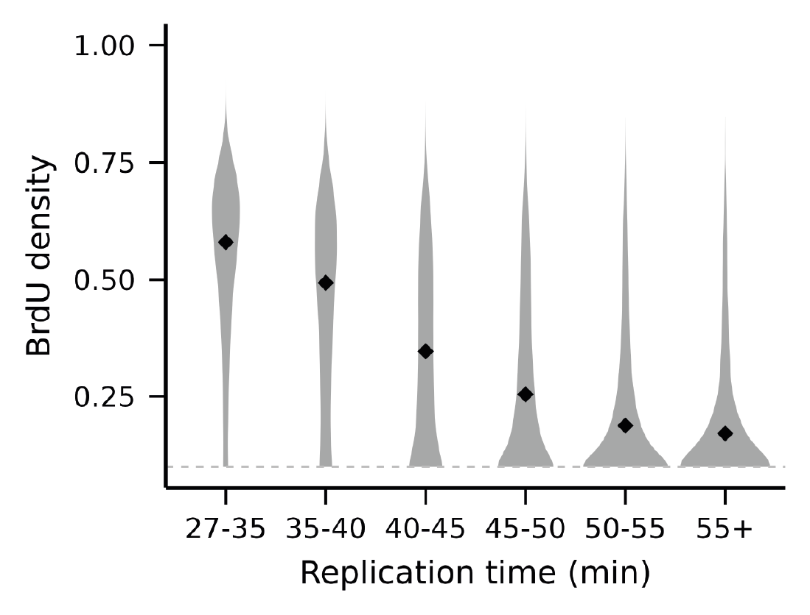

Here we discuss how to make a plot like the one below
(please do not assume the one below is made from real data).
The basic idea is that we have some binned, population-level measurement
like median replication time in the example below. We collect
reads passing through each bin of the population measurement,
measure mean BrdU density per read per bin, and then make the histogram.
You can customize the scripts below to do this for any kind of
population measurement, not just median replication time.



The following instructions also involve some steps to lift over the measurement
between genomes. This is relevant only if the population-level measurement
is reported using a different reference genome than the one you are using
for modification calling (e.g. population on sacCer3 vs BrdU calling on 
W303 in the example below). If you do not have this problem, then please
do not do the liftOver steps.

```bash
# 1. make a chain file from sacCer3 -> your genome.
#    use commands similar to the below command but substitute your own files and filepaths.
#    use the script specialized_analyses\liftOverChainCreation_v2.sh in our repo.

output_chain=/some_dir/sacCer_3_-_sacCer_w303.over.v2.chain
target_fasta=/some_dir/sacCer3.fa
query_fasta=/some_dir/w303.fa

bash liftOverChainCreation_v2.sh $target_fasta $query_fasta $output_chain chrM,chrM

# 2a. lift over trep from sacCer3 to your genome
#     use commands similar to the below command but substitute your own files and filepaths
#     and maybe even your own parameters.
#     please do 

source load_package.sh -liftOver

old_bed=$(pwd)/trep_sacCer3_data.bed
new_bed=${old_bed/data.bed/data_liftOver_w303.bed}
unmapped=${new_bed/w303.bed/w303.unmapped.bed}

$liftOver -minMatch=0.5 $old_bed $output_chain $new_bed $unmapped # can change 0.5 to something else if you want.

# 2b. change the format of the trep table from above.
#     we are removing the strand column

awk -v OFS="\t" '{print $1, $2, $3, $4, $7}' $new_bed > "$new_bed".cutStrand

# 3. subsample modbam to retain only a few reads to save run time of script.
#    use your own files and file paths below.

overall_mod_bam=
mod_bam=

samtools view -h -s 0.1 -e 'rlen>=30000' $overall_mod_bam > "${mod_bam/mod.bam/mod.tmp.bam}"
samtools sort -o $mod_bam "${mod_bam/mod.bam/mod.tmp.bam}"
samtools index $mod_bam
rm "${mod_bam/mod.bam/mod.tmp.bam}"

# 4. run run_get_read_brdU_ref_coord_int.sh
#    use your own files and file paths below.

temp_dir=
output_file=

sbatch run_get_read_brdU_ref_coord_int.sh $mod_bam "$new_bed".cutStrand $output_file $temp_dir

# 5. run the plot making software
#    use plots_for_publication\plot_brdu_violin_vs_trep.R
#    use your own files and file paths below.

< $output_file Rscript plot_brdu_violin_vs_trep.R /path/to/output_file.png
```