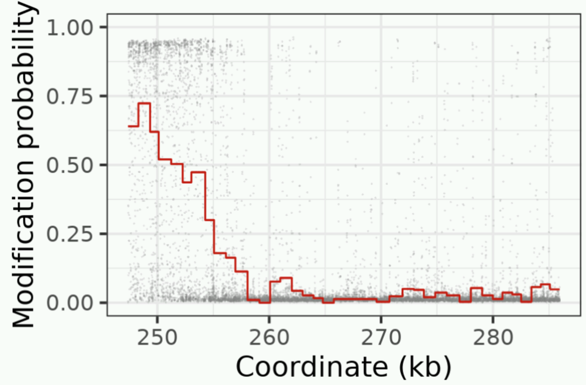
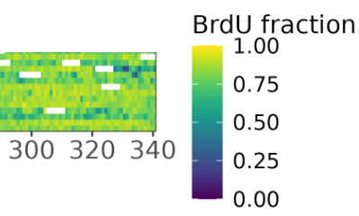

# Instructions to use scripts in the repository to make 'rainplots' and 'heatmaps'

## Introduction

We describe here how to use the scripts in the repository to make plots of analogue modification data,
which we colloquially call 'rain plots' if we are plotting reads one at a time, or 'heatmaps' if we
are plotting multiple reads stacked horizontally and vertically in a 2D diagram.
Two examples are shown below: a rainplot and a section of a heatmap
(please do not assume the plots below are made from real data).




Each rain plot represents analogue modification probability on one molecule versus position on the reference genome.
The plotted probability can be raw data, or windowed data, or a best-fit model, or any combination.
The plotted points of the raw data look like falling rain, hence the name rain plot.

Most plotting scripts are in the `plotting_and_short_analyses` directory.

Whenever .mod.bam files are used as inputs to plotting scripts, they should have been sorted
already and must have an index file associated with them. For example, if you are intending to use a file
called `my_file.mod.bam` as an input to plotting scripts, then the file must be sorted and the index file
`my_file.mod.bam.bai` must exist.

If the mod bam file was not made by us, then add the custom `XR` and `XA` tags to the mod bam file
using the `add_XR_tag_to_modBAM.py` and `add_XA_tag_to_modBAM.py` scripts before running plotting scripts.

The plotting scripts should work with minimal changes on any type of base modification.
The default is to plot thymidine modifications with the tag T i.e. T+T.
(Please consult [this](https://samtools.github.io/hts-specs/SAMtags.pdf) documentation
on modification tags like T+T if you do not know much about them).

Advanced plotting workflows are in the `advanced_plotting_workflows.md` note.

## Usual plotting workflows for heatmaps

Use the following commands to make heatmaps. Please note that heatmaps only work
for molecules aligned to a linear reference genome. Also it is a good idea to
subsample a large mod BAM file before plotting it, as it takes some time to
window a lot of reads, and a picture with lots of reads looks too crowded.
After plotting a subsampled mod BAM file, you can go to a non-subsampled,
larger file if you desire to.

```bash
# Set the parameters below suitably; window size is in bp.
fasta_file=
fasta_index_file=
window_size=1000

temp_directory=
mkdir -p "$temp_directory"

output_file=
mod_bam=

sbatch run_get_read_brdU_ref_coord_generated_reg_int.sh "$mod_bam" "$fasta_file" "$fasta_index_file" \
  $window_size "$output_file" "$temp_directory"

# below plots chrI chrII chrIII, you can sub other contigs or only one contig.
data_file="$output_file"
op_dir=
mkdir -p $op_dir
cd plotting_and_short_analyses;
for contig in chrI chrII chrIII; do
< $output_file grep -v '^#' |\
  awk -v IFS="\t" -v OFS="\t" -v a="$contig" '$1==a' |\
  sed '1icontig\tstart\tend\tx1\tx2\tread_id\tmod_qual\tx3' |\
  Rscript plot_heatmap.R - "$op_dir"/plots_"$contig" 
  echo "$contig done."
done

# - you can customize the awk command above to plot only
#   one section of a contig if you want.
# - you can also supply additional inputs like a pause file
#   or tell the program to plot additional features in the case
#   that you are visualizing reads passing through the rDNA;
#   please have a look in the script.
```

## Usual plotting workflows for rainplots

If you are a first-time or casual user, then use the plotting scripts in this section.
Most or all of these plotting scripts are in the folder `plotting_and_short_analyses/`

- To make rain plots from one read, use `limited_plot_read.sh`.
- To make rain plots from many reads and collect them into a pdf, use `plot_n_reads.sh`.
- To make rain plots from many nascent reads, use `plot_n_nascent_reads.sh`
or `plot_filtered_n_nascent_reads_noChrM.sh`. The latter makes a pdf with all plots as well.

### Limited plots: Only raw and windowed data from one read with fork annotation if desired

Script to be used here is `limited_plot_read.sh`.
A sample command follows.
Replace the input parameters suitably.
Can also use `sbatch` in place of `bash`.

```shell
bash limited_plot_read.sh sample.mod.bam readID 300 output_dir
```

The command writes out a plot data file `plot_data_<readID>` and a plot image `plot_<readID>.png`
to the output directory (angle brackets mean perform substitution).
The plot has raw and windowed data (whose size is 300 thymidines) corresponding to the read id from the mod bam file.
Set window size to zero if you do not want windowing.

Other ways of running the command are:

```shell
bash limited_plot_read.sh sample.mod.bam readID 300 output_dir abcd
```

In this command, the prefix 'abcd' is used instead of the prefix 'plot' in output-file naming
i.e. the output files are now `abcd_data_<readID>` etc.
Useful to denote when something other than analogue density is being plotted e.g.: fork probability
can be plotted if a fork probability mod bam file is used.

```shell
bash limited_plot_read.sh sample.mod.bam readID 300 output_dir abcd $annotation_file
```

To plot fork features such as origins etc. on the plot, use an annotation file.
The `$annotation_file` is space-separated and has three columns (without headers):
start, end, label. start and end refer to locations on the reference genome,
and label can be 'origin', 'termination', 'leftFork', 'rightFork', or 'pause'.

### Plot only raw and windowed data from many read ids

The following command submits one plotting job per read id to the slurm scheduler on an HPC.
Read ids are expected to be listed in one column without any header in the file `read_id_list.txt`.

```bash
< read_id_list.txt  awk '{print "sbatch limited_plot_read.sh '$mod_bam' " $0 " 300 '$op_dir' "}' | bash
```

### Plot many nascent reads selected at random

The script below plots a few reads containing analogues picked at random from the mod bam file to get
a sense of the data.
We identify nascent reads as those with mean analogue densities above a threshold. 
We need a file containing read ids and one mean analogue density per read as an input. 

```bash
sbatch plot_n_nascent_reads.sh $n $mod_bam_file $stats_file $output_dir $window_size $threshold
```

Can use `bash` in place of `sbatch` if need be.

* `$n` is the number of nascent reads picked at random for plotting.
CAUTION: Use small numbers like 10-30, not large numbers like 100+.
* `$mod_bam_file` is the mod bam file with analogue modification information.
* `$stats_file` is a tab-separated, header-less file. 
First column is read id, second column is mean brdu averaged over entire read.
* `$output_dir` is the directory where plots made by this program are sent.
* `$window_size` (in thymidines) is the size of windows used to form the averaged curve.
* `$threshold`, only rows in `$stats_file` with second column above threshold value are considered nascent.


### Plot many nascent reads selected at random from a subset

Here, we plot a few reads selected randomly from a subset where 
- all reads map to alignments whose lengths are above a threshold value
- each read contains at least one fork of length above another threshold value
- reads don't map to chrM

Here, we assume that nascent reads are those that contain sufficiently long forks, unlike
the previous subsection where our criterion was a minimum mean analogue density.

```bash
sbatch plot_filtered_n_nascent_reads_noChrM.sh $n $forkLenThres $alignLenThres $mod_bam\
  $mod_bam_left $mod_bam_right $forkSense_dir $output_dir
```

* `$n` is the number of nascent reads picked at random for plotting.
CAUTION: Use small numbers like 10-30, not large numbers like 100+.
* `$forkLenThres` is the minimum fork length in kb
* `$alignLenThres` is the minimum alignment length in kb
* `$mod_bam` is the mod bam file with analogue modification information.
* `$mod_bam_left` is the mod bam file with left fork probability information.
* `$mod_bam_right` is the mod bam file with right fork probability information.
* `$forkSense_dir` is the directory where forkSense output files like fork directions, origins are present.
* `$output_dir` is the directory where plots made by this program are sent.

NOTE: if the fork length threshold is set to zero, then the criterion of each read containing
at least one fork of length above a threshold is dropped.

### Take a list of read ids as input, and produce one pdf with many plots as output

We put together some steps discussed in the previous sections into one script `plot_n_reads.sh`.
The list of read ids is present in a text file `$read_id_file` with no header.
Three plots per read id are produced - analogue modification, left fork, right fork probabilities.
All three plots with the underlying data are sent to `$op_dir`.
If pause information is available, model curves are plotted on the analogue modification data.
Various forksense features such as origins are shown on the curves.
All the plots and associated fork data are rendered into a pdf also sent to the same output directory.

Usage 1: with pause information available

```bash
bash plot_n_reads.sh $read_id_file $mod_bam $mod_bam_left $mod_bam_right $forksense_dir $pause_file $fasta_file $op_dir
```

Usage 2: no pause information available

```bash
bash plot_n_reads.sh $read_id_file $mod_bam $mod_bam_left $mod_bam_right $forksense_dir /dev/null /dev/null $op_dir
```

Usage 3: Some information per read id is contained in a tab-separated file (with headers) `$tsv`.
The file has a column `detectIndex` whose entries are strings that contain the relevant read id per row.
The user desires to display the information associated with each read id below the plots of that read id.

```bash
bash plot_n_reads.sh $read_id_file $mod_bam $mod_bam_left $mod_bam_right $forksense_dir $tsv /dev/null $op_dir
```

Usage 4: No forksense or pause data available at all.

```bash
bash plot_n_reads.sh $read_id_file $mod_bam "" "" "" /dev/null /dev/null $op_dir
```

From the previous sections, the meanings of the input parameters should be clear.
Otherwise, refer to the script for explanations.
`/dev/null` is a special linux file that means an empty file.